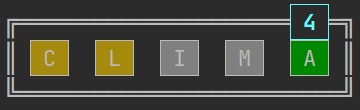
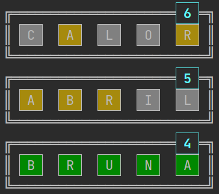
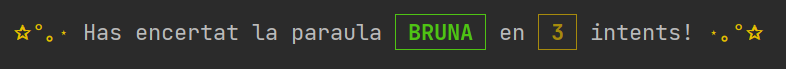
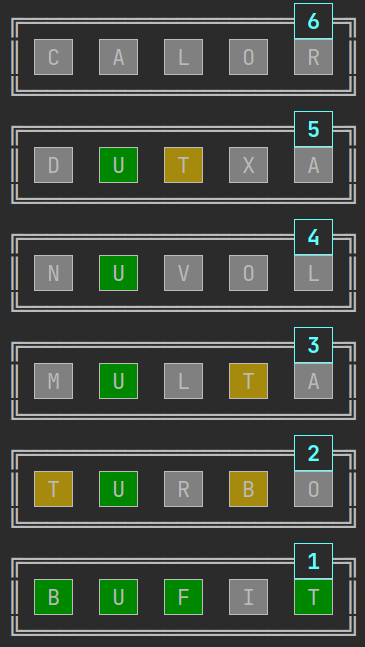
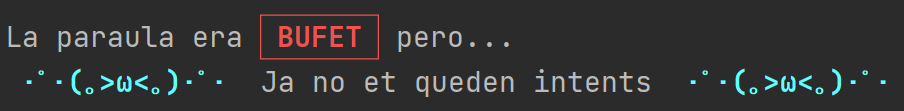
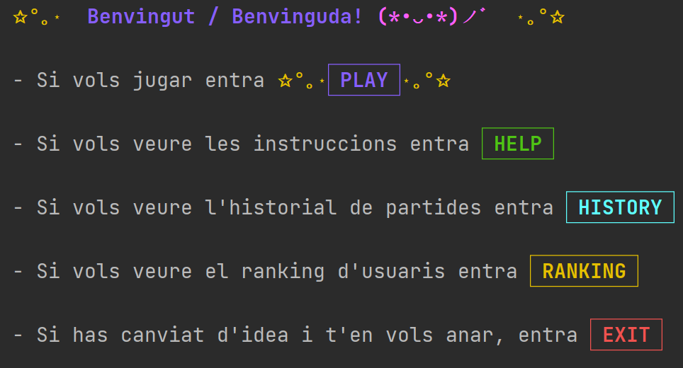

# Wordle

## Description
This project consist of the famous game called Wordle where
a random word is generated and the user has X tries to guess
the word.

Based on the character position of the entered word it will display
a colored background on that character. Displaying:
- A gray background if the character doesn't exist in the word.
- A yellow background if the character exists in the word but isn't in the right position.
- A green background if the character exists and is in the right position.

It had been developed in IntelliJ IDEA with the Kotlin language.

---

## Author

[Ivan Martinez Cañero](https://gitlab.com/ivan.martinez.7e6)

---

## Installing

Use git to clone this repository into your computer.

> git clone https://gitlab.com/ivan.martinez.7e6/wordle

---

## Running the project

Open the project with IntelliJ IDEA and run the file.

### Formatting the Output

In this project we will make use of variables to
color the foreground and background of each character
when needed.

#### Usage

* Write the name or names of the constants you want
  to use before the next word or character
* Use the variable `reset` after the desired word or character to end the formatting

---

## How To Play

- The user has 6 tries to guess the right word
- Each word has 5 characters
- The characters of the word doesn't repeat themselves
- If the background of the character of the guessed word
  changes to **gray** it means it doesn't exist in the word.
- If changes to **yellow** it means it exists in
  the word but is not in the correct position.
- If  changes to **green** it means it is in the
  correct position.

---

### Code

The ***instruccions*** function will explain the user how to play
and will ask the user to type ***START*** to begin.

### The Game

The ***codi*** function is where the word pool of the game and all the logic of the application lies.
- First will take a random word from the `wordPool` and will ask the user for a word.
- If the word has repeated chars or doesn't have a length of 5 chars it will throw a warning and will ask
  for a word again.

##### When the word is accepted and isn't the right guess

- It will scan every char at the `userGuess` word and compare
  the position with the same position of the char of the random
  word.
- At the same time will be colored based on the position and added
  to a variable called `history`
- Then it will be added to a list called `historyList` and with each iteration will print the content
  of the list creating the history of the game
- The program will also print the number of the current round.
- Last it will rest 1 try and will communicate to the user how many tries has.

 

##### When the word is the right word

Will print a congratulation message and will show the tries used.

##### When the user spends all their tries

Will end the program and the game with a lose.

#### After the game

If the tries reach 0 or the user guesses the word it will ask if the user wants to continue playing,
read the rules or stop playing.

---

### License

This project is licensed under the [GNU Affero General Public License v3.0](https://choosealicense.com/licenses/agpl-3.0/) 

See the [LICENSE.md](LICENSE) file for details

